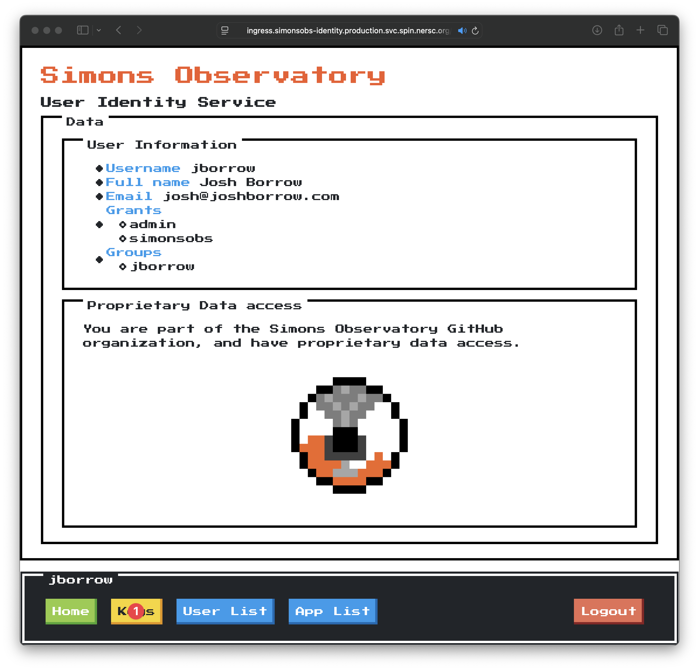
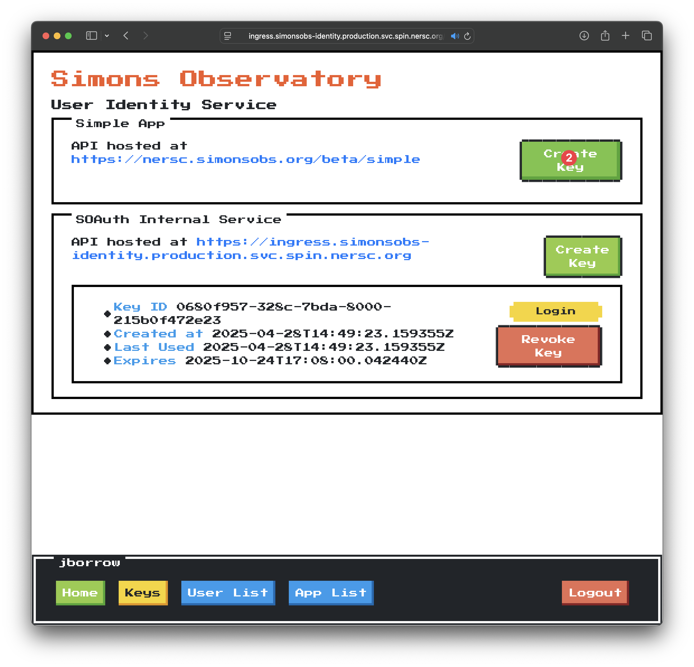
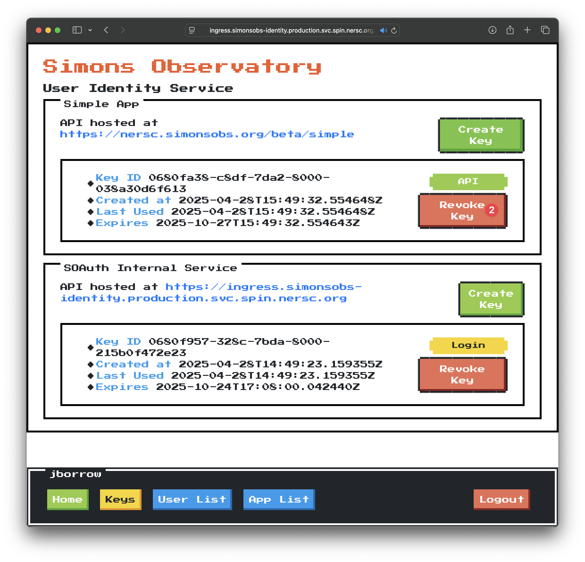

API Keys
========

Applications registered with SOAuth automatically qualify for 'login' session management,
which we outlined in the instructions on [creating an app](create.md). Many applications
also require the ability for users to generate 'API keys' that can be used to authenticate
against applications programatically.

SOAuth provides this functionality through the 'keys' sub-menu. Users can request
API keys, which are shown once and only once. These API keys are long strings that must
be protected.

The API Key Flow
----------------

API keys use the exact same access mechanism as the tokens used for web applications.
The key that is returned from the management interface is actually a refresh token, which
must be exchanged with the identity server for an access token before access to the
protected resources can be granted. Additionally, it's important to remember that
SOAuth implements 'refresh token rotation' - every time you get a new access token,
the refresh token is also replaced. The process works as follows:

1. A user retrieves an initial API key (refresh token A) from the management interface.
2. The user exchanges refresh token A for access token B and refresh token B via
   a post endpoint _at the indentity service_.
3. The user makes use of the access token to access protected resources via the
   destination API, sending the token as a cookie. The user must then either:
   - Manage the lifecycle of the access token themselves. Once access token B
     expires, they must exchange refresh token B for access token C and refresh
     token C, and continue on. This will involve handling 401 errors or careful
     timing of the age of the access token (its expiry time was provided by
     the identity service during the exchange).
   - Continually monitor the refresh token cookie as it comes back from the
     API endpoint. If it has changed, it must be serialized such that when the
     user's script or session ends, the correct refresh token is stored. Attempting
     to authenticate with refresh token A once token B, or token C, and so forth
     have been emitted by the indentity server will fail.

We provide functionality for managing this lifecycle within SOAuth itself. It is critical
to realise that API keys can only be used by a single client at a time; that should hopefully
be clear as a consequence of the refresh token rotation. You can generate as many 'parallel'
API keys you like from the management interface at this time.

Creating an API Key
-------------------

Creating an API key is simple, and can be handled through the web interface. Again, remember
that _after you first use this key, it will be invalidated_, and as such you either need
to manage its lifecycle yourself or use the built-in SOAuth tools.

Then, click the 'create key' button on the appropriate tab:

Finally, you should copy the key out and make use of it.

Revoking an API Key
-------------------

The list of all of your keys on the keys page, which can be navigated to from the management
interface home:

To delete a key, you simply click on the 'Delete Key' button:

The next time this _refresh_ key is used, it will not work. Note that any _access tokens_
(i.e. currently active sessions) will remain value until they expire.

**Next**: [hosting SOAuth](hosting.md)