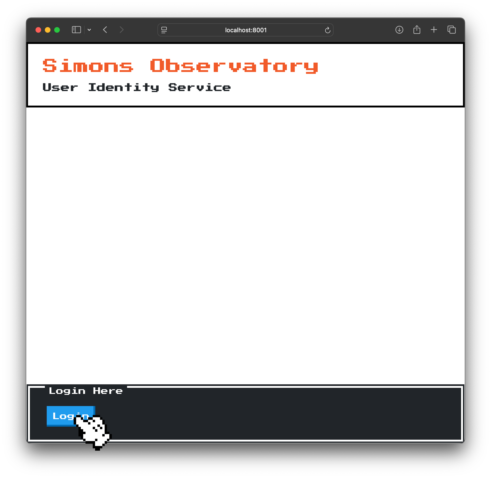
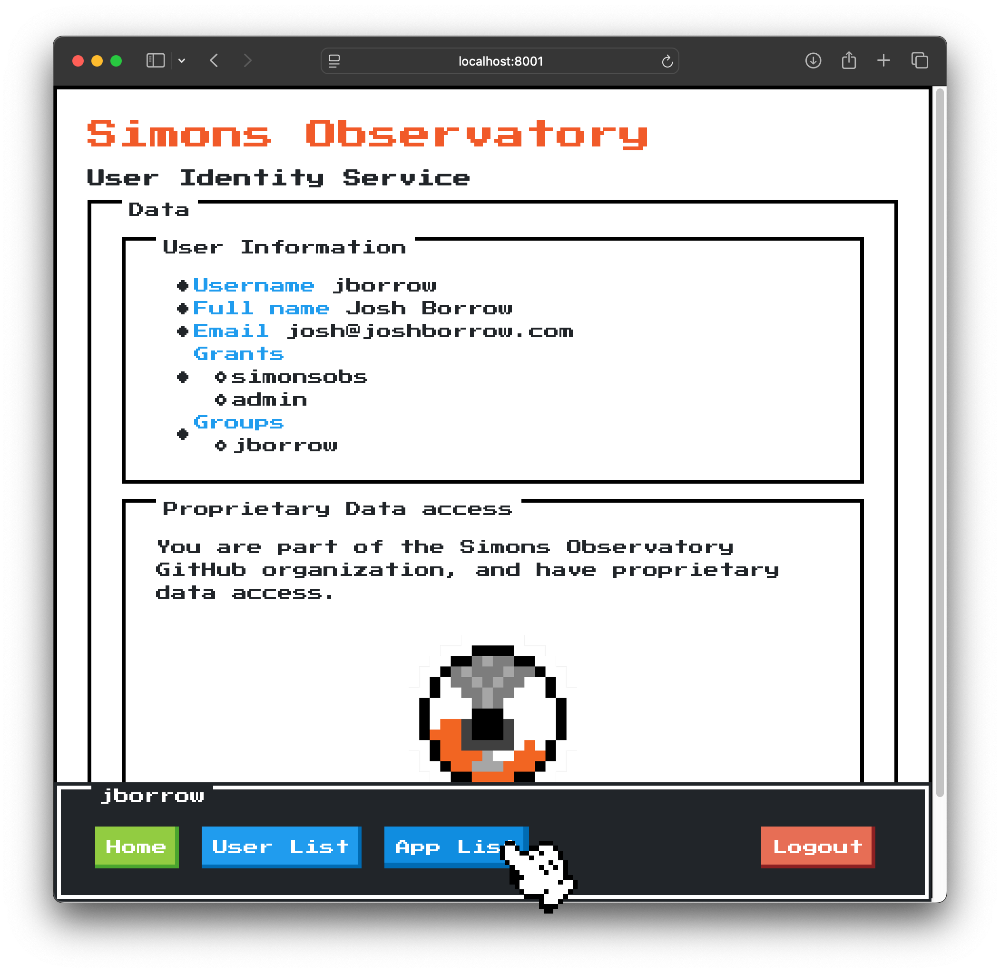
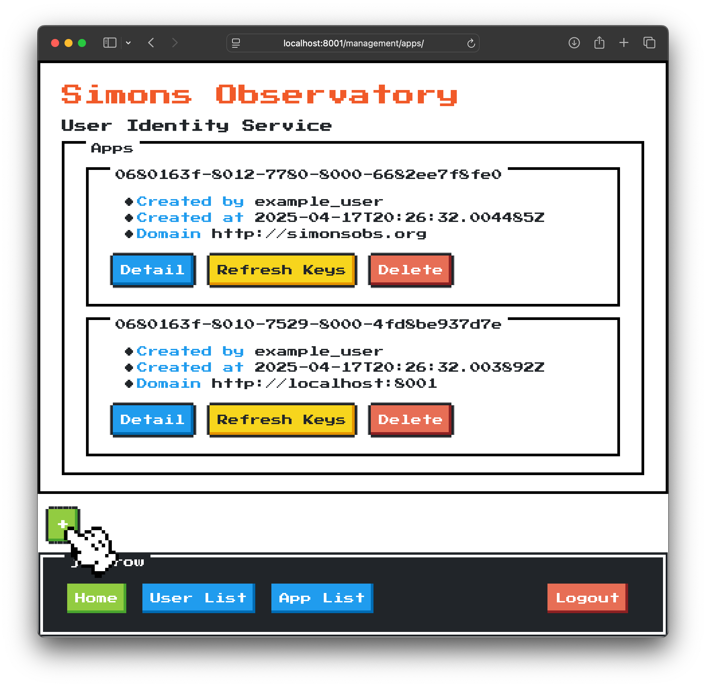
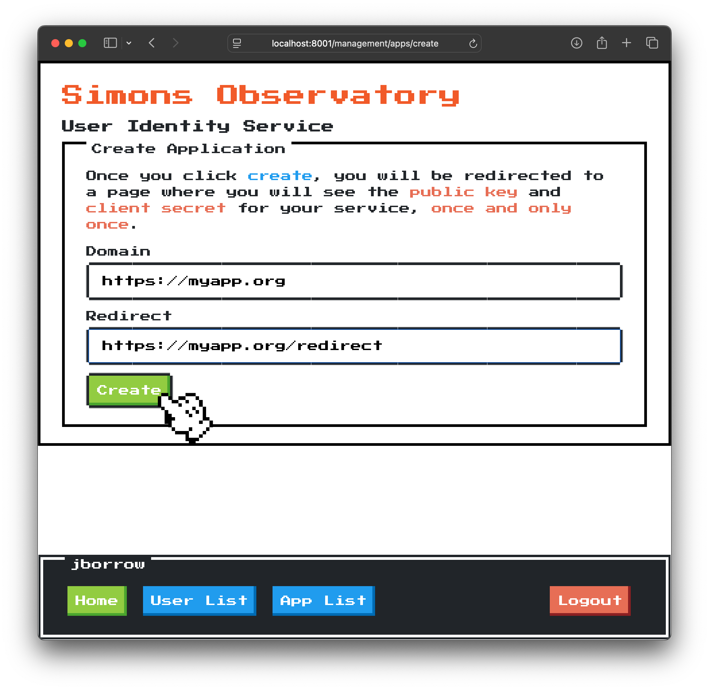
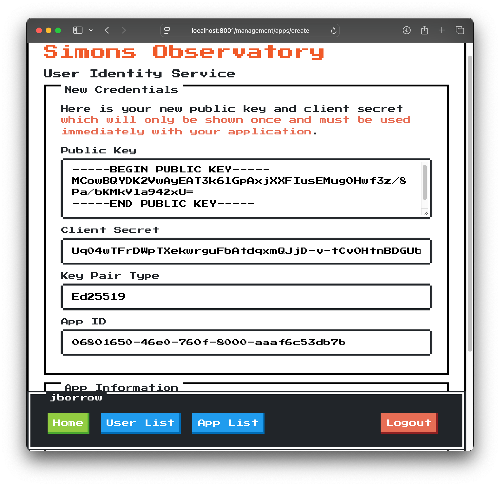

Creating an App
===============

'Creating' an app has two main components: adding software to your application
that allows for its use with the SOAuth service, and registering your application
with a service and gaining credentials. This guide is as such split into two parts,
and assumes that you are trying to develop a protected Starlette or FastAPI
application.

Modifying Software
------------------

If you have a pre-existing FastAPI application that you would like to protect
with SOAuth, it is relatively straightforward. There are two potential approaches:
using a middleware, or using dependencies. In the SOAuth repository, both of these
are used; if you do not know which to use, we suggest starting with middleware. For
both, we provide a helper function `global_setup` that provides:

- Registration of constants on the `app` that are required for the rest of the
  functionality to work.
- Middleware for decoding access tokens and refreshing them.
- API routes for logouts and redirect handling from the main SOAuth application.

The examples below use a number of constants that are explained when we discuss
registration of your app.

### Middleware

To use the helper function to protect routes using middleware:

```python
from fastapi import FastAPI
from soauth.toolkit.fastapi import global_setup

app = global_setup(
    app=FastAPI(),
    app_base_url=app_base_url,
    authentication_base_url=authentication_base_url,
    app_id=app_id,
    client_secret=client_secret,
    key_pair_type=key_pair_type,
    public_key=public_key,
)
```

To protect routes, you then simply need to use `requires` or manually check
that the scope/grant (these terms are interchangeable) are available (in this case
the user must have the `admin` grant):

```python
from starlette.authentication import requires

@app.get("/test")
@requires("admin")
async def test(request: Request):
    user = request.user
    scopes = request.auth.scopes
    return {"user": user, "scopes": scopes}
```

### Depenedencies

To use the helper function to protect routes without middleware:

```python
from fastapi import FastAPI
from soauth.toolkit.fastapi import global_setup

app = global_setup(
    app=FastAPI(),
    app_base_url=app_base_url,
    authentication_base_url=authentication_base_url,
    app_id=app_id,
    client_secret=client_secret,
    key_pair_type=key_pair_type,
    public_key=public_key,
    add_middleware=False,
)
```

Now all routes can use a dependency to get the current user. We provide
two default dependencies, one for any user (even if they are unauthenticated)
and one that requires authenticated users.

```python
from soauth.toolkit.fastapi import UserDependency, AuthenticatedUserDependency

@app.get("/test")
@requires("admin")
async def test(request: Request, user: AuthenticatedUserDepdendency):
    scopes = user.grants
    assert user.is_authenticated
    return {"user": user, "scopes": scopes}
```

Registering an App
------------------

Registering an app is a simple process. It requires the `appmanager` grant on your
account in the SOAuth server you are trying to use. You will need to know:

- Your applications domain (including path if you are running behind a reverse proxy).
  For example, `https://myapp.org/reverse/proxied`. For the remainder of the example
  we will assume this is `https://myapp.org`. This is also known as the `app_base_url`.
- Your redirect url, which is where the user will be redirected after completing
  the SOAuth part of the exchange. If you use the default handlers above, this
  will be `https://myapp.org/redirect`. 
- The authentication server's url, for example `https://soauth.org`. This is known as
  the `authentication_base_url`.
- The server will provide you:
  + Your `app_id`, a UUID.
  + Your `client_secret`, a urlsafe string.
  + Your `key_pair_type`, the type of encryption being used.
  + Your `public_key`, the public key you will use to decode `access_token`s.

Below we will walk you through the steps of performing this.

First, log in to the SOAuth service you are using:



Second, click on the 'App List' button. If you don't see this, you do not have either
the `appmanger` or `admin` grant.



Third, click on the green 'plus' to create a new app.



Fourth, enter your app's URL and it's redirect url:



Finally, after creating, you will be presented with the required information. Be careful,
these will only be shown once - if you want to see them again, you will need to refresh them
(and this will invalidate your existing keys!)



**Next**: managing users