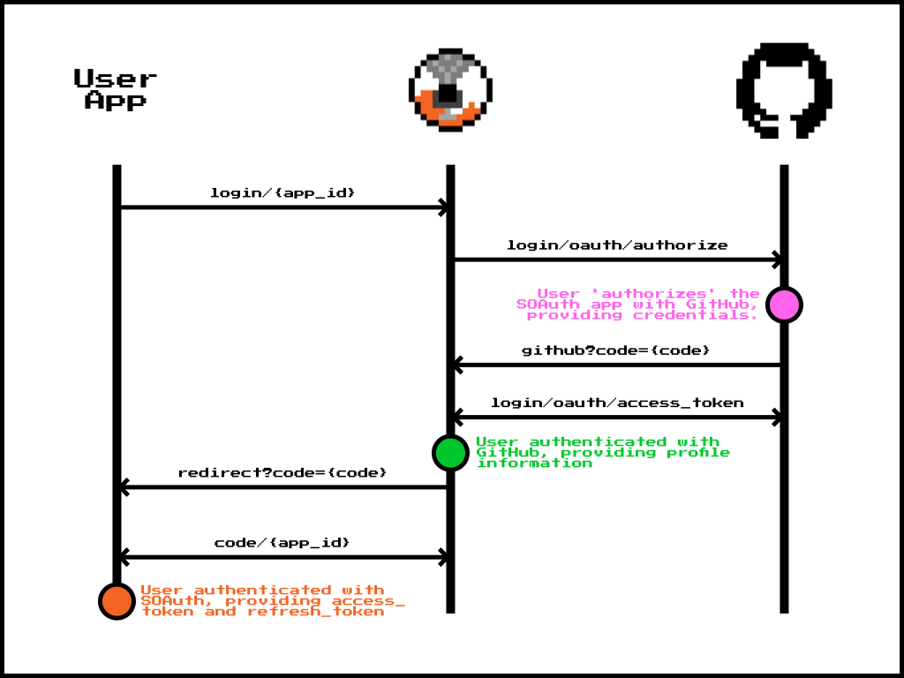

Introduction
============

SOAuth attemps to be compatible with the OAuth2 specification. As such, authentication
occurrs through a series of steps:

1. Authentication is initialized through a redirection to an authorization page.
2. Once credentials have been validated, the user is redirected back to the original app,
   but to a specific endpoint that takes a 'code' that can be exchanged on the backend.
3. This 'code' is exchanged by the backend for an authentication token, giving access
   to the service. This token can be transformed into one providing access to the app.
4. The frontend for the app stores this token and passes it with each request for
   re-validation.

Authentication in Practice
--------------------------

Assuming the soauth server is running at `soauth.org` (note this doesn't exist!), and your
application is running at `myapp.org`, the authentication flow works as follows:

- A user in your application is directed to log-in, perhaps through a regular link,
  to `soauth.org/login/{app_id}` where `app_id` is a UUID for your app. Example:
  `<a href="https://soauth.org/login/bc5af7c9-6525-449b-92db-ae935e115f6a" referrerpolicy="no-referrer-when-downgrade">Login</a>`[^1]
- The SOAuth server catalogs this request, and then forwards your user to the GitHub
  OAuth page for them to log in. They enter their GitHub username and password, and
  authorize the SOAuth service to access their profile information.
- Once GitHub has verified this information, the user's browser is redirected back
  to SOAuth, to `soauth.org/github`. In handling this request, the SOAuth service
  contacts GitHub's servers to perform the [GitHub OAuth code exchange](https://docs.github.com/en/apps/oauth-apps/building-oauth-apps/authorizing-oauth-apps#2-users-are-redirected-back-to-your-site-by-github)
  and to access the [GitHub API](https://docs.github.com/en/apps/oauth-apps/building-oauth-apps/authorizing-oauth-apps#3-use-the-access-token-to-access-the-api) to
  discover information about the user (for instance their username).
- An internal SOAuth user is then either created, or pulled from the database,
  and checked for consistency against the information from GitHub.
- The user's browser is then redirected back to your application, towards the
  `myapp.org/redirect` endpoint, along with yet another code.
- Your server then handles this request by exchanging this code with the
  `soauth.org/code` endpoint. The response to this request is two tokens:
  an `access_token`, and a `refresh_token`. It also includes the `redirect`
  url which was pulled from your user's browser when they initially were directed
  to the login page.
- Your server sets the `access_token` and `refresh_token`s as cookies, which
  are included in every request to the server.

This is essentially a double OAuth2 flow; SOAuth does not itself actually
hold authentication credentials, using GitHub instead.

What are Tokens For?
--------------------

When an `access_token` is included in a request to your app, you can use
middleware or other functionality to decode it. As part of the [app setup process](create.md),
you will have been given a 'public' key (note that this is not really for public
consumption)!

The public key can be used to decrypt the contents of the `access_token`, which is
a [JSON Web Token](https://en.wikipedia.org/wiki/JSON_Web_Token). We use asymmetric encryption,
meaning that if your public key can decode the contents of the token, you can be sure
that the place that emitted it was the SOAuth server.

Contained in the `access_token` is the `user`, which is the `UserData` model, containing:

- `user_id`, a UUID uniquely describing a user across _all_ SOAuth apps.
- `user_name`, a string uniquely describing a user across _all_ SOAuth apps, which is also
  their GitHub username.
- `full_name`, an optional string containing their 'real' name, like `John Smith`.
- `email`, an optional string containing the user's email, like `user@email.net`.
- `grants`, a set of strings providing information on what a user should be allowed to do.
  This can be things like `admin`, or `appmanager`, or `dataaccess`.
- `groups`, (currently unused), a list of groups that the user is a part of.

Because of the public-key encryption model, you can always be sure that the contents of
this blob are valid and were correctly emitted by the server. As such, if a user presents
a valid `access_token` and it says their username is `jborrow`, you can believe them!

Nothing Ever Lasts
------------------

Because of their almighty power, `access_token`s usually have a very short expiry time,
of order a few hours. Enter the `refresh_token`. `refresh_token`s are used to exchange
with the main authentication server for a new `access_token`, after performing server-
side validation of user credentials. By doing this, the contents of a user's `access_token` are
kept up to date - if grants are removed or added, or an e-mail address changes, they are
updated when this exchange takes place.

In practice:

- A user makes a request to a page on your site, such as `myapp.org/private`. The server
  tries to decode their access token, and finds that it is expired!
- In the background, your server then makes a request to `soauth.org/exchange/{app_id}` with the
  user's refresh token.
- The authentication server responds with a new `access_token` _and_ a new `refresh_token`.
- Your server can then set these as new cookies, and send your user on their way.

When this process takes place, the old refresh token is expired on the server-side, meaning
it can never be used again. This helps protect against stolen credential attacks.

[^1]: Note the use here of `referrerpolicy="no-referrer-when-downgrade"`; if this is not used
      the full path of your client is not sent to the authentication server, and the eventual
      redirect won't work.