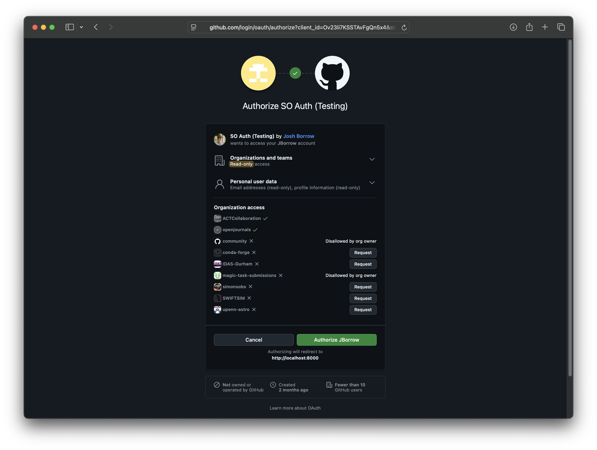

Organization Checks
===================

A critical piece of funcionality in soauth is the ability to automatically grant
and revoke certain access based upon membership of a given GitHub organization.

On the server side, this is configured through the `SOAUTH_GITHUB_ORGANIZATION_CHECKS`
variable. This is a list of organizations that should be checked against when a user
logs in with GitHub. An example list of organizations could be:
```
SOAUTH_GITHUB_ORGANIZATION_CHECKS='["simonsobs","ACTCollaboration"]'
```
Each organization check occurs independently.


Setup
-----

On startup, soauth checks for (and create if not present) a user and a group
with the same name as the organization. Note that user groups, user names, and
grants are all lowercase by specification. At this stage, there is no
communication wtih GitHub.

When a user attemps to log in, they are presented with a screen that allows
them to request acceess to specific organization.



Organization access is granted on an app-by-org level, and as such once a single
user's request has been allowed all future logins will be pre-authenticated. The
organization that created the OAuth2 application is pre-granted access.

For this feature to work, the OAuth GitHub application must have access to
organization's details.


During Login
------------

During a user login, soauth requests information from the organizations in the
checklist. If the user is a member of those organizations, they are provided a
grant with the same name and are made a member of the soauth group of the same
name. If users have since been removed from those GitHub organizations, their
group membership and grant are automatically revoked.


During Refresh
--------------

As part of the regular acces token refresh flow, the GitHub credentials from the
user are used to again check membership of the organizations and appropriately
add and remove grants and groups.


Implications of SOAuth's Decentralised Approach
-----------------------------------------------

Because there is not continuous communication between the soauth server, GitHub,
and applications using soauth as a login solution, there will be latency between
users joining and leaving GitHub organizations and those changes being reflected
in their login credentials.

If a user has just joined a GitHub organization, and you would like to rapidly
grant them access to new resources that are protected by such group membership,
they simply need to log out and back in. Each login flow refreshes all information
with GitHub.

If a user has been removed from a GitHub organization, there will be a latent
period where they will still have access to protected resources. This latency
is set by the expiry time of an access token (by default, 8 hours). This is
true of any grant or group membership within soauth, and not just those
moderated by membership of GitHub organizations.

**Next**: [API keys](api_keys.md)